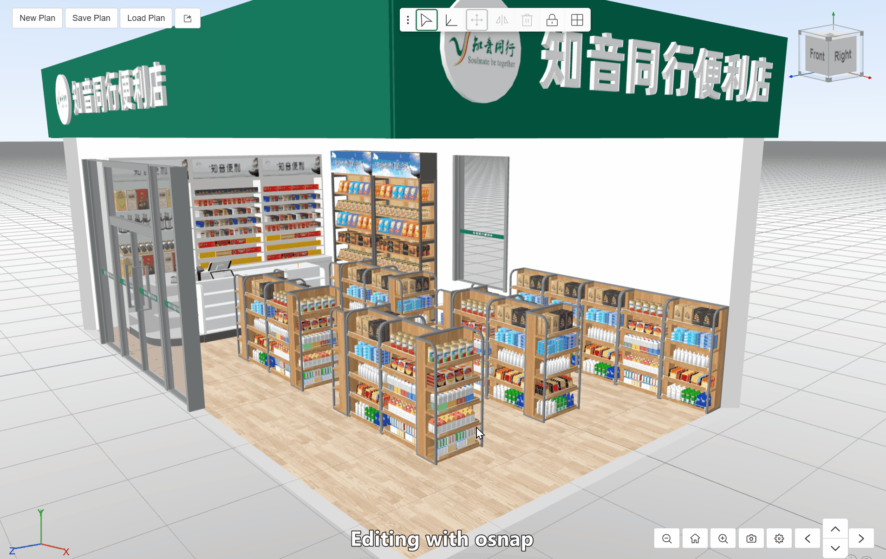

# bp3d-examples
An example project for bp3d.

## What is bp3d?
bp3d is a js library built on three.js that allows users to design an interior space such as a home, apartment or shop. Its code references the [blueprint3d](https://github.com/furnishup/blueprint3d) implementation.


Many thanks to three.js, blueprint3d, npm, etc.

## Features
- Edit in 2d floorplan to create walls/rooms

- Edit in 3d model design to add entities. E.g., s/he can add doors, windows, furnitures, etc.

- Edit entity with gizmo and snap

- Toggle wall exterior and roof visibility


## Plugins
It is easy to build your own plugins based on @bp3d/core.

These are some plugins in @bp3d/plugins:
- AxisGizmoPlugin
- GroundGridPlugin
- SkyboxPlugin
- ToolbarPlugin
- ViewCubePlugin

## Examples
```
import { Viewer2d, Viewer3d } from "@bp3d/core";
import { SkyboxPlugin } from "@bp3d/plugins";

const viewer3d = new Viewer3d({ containerId: "viewer3d" });
new SkyboxPlugin(viewer3d);

const myPlan = "http://www.abc.com/myplan.bp3d";
viewer3d.loadPlan(myPlan);
viewer3d.goToHomeView();
```


## API guidelines
### JSON
Json Encoding: UTF-8 encoding without BOM

### Coordinate System
Uses `right handed`, `y-up` coordinate system, which is consistent with three.js and glTF. That means,
- User need to make sure any input data (point, direction, bounding box, matrix, etc.) is `right handed`, `y-up`.
- Any data an API returns, is `right handed`, `y-up`.

<table>
  <caption style="background-color: #aaaaaa">
    Typical coordinate systems
  </caption>
  <thead>
    <tr>
      <th scope="col">Platform</th>
      <th scope="col">Handed</th>
      <th scope="col">Up</th>
    </tr>
  </thead>
  <tbody>
    <tr>
      <th scope="row">UE</th>
      <td>left handed</td>
      <td>z-up</td>
    </tr>
    <tr>
      <th scope="row">Three.JS / glTF</th>
      <td>right handed</td>
      <td>y-up</td>
    </tr>
    <tr>
      <th scope="row">Unity 3D</th>
      <td>right handed</td>
      <td>z-up</td>
    </tr>
    <tr>
      <th scope="row">Revit / SketchUp / 3dMax</th>
      <td>right handed</td>
      <td>z-up</td>
    </tr>
  </tbody>
</table>

### Units
- Length unit: `Meter`
- Area unit: `Squre Meter`
- Angle unit: `Degree` (0 - 360), Counter clock wise (CCW)
- Time unit: `Second`

### Matrix
A matrix is an array of 16 float numbers, in column-major order, length unit is Meter.

### Color
use `rgb/rgba`, values between 0-1

### Case sensitivity
All strings are case sensitive unless otherwise specified.
